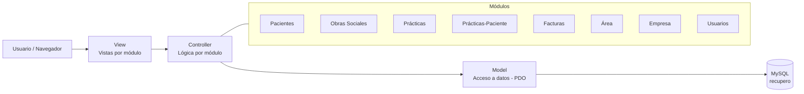

# SISRECUPEROS


Sistema web de gestión de recuperos médicos. Permite administrar pacientes, obras sociales, prácticas, facturación y usuarios del sistema bajo una arquitectura **MVC** en PHP nativo con persistencia en MySQL vía **PDO**.

## Tabla de contenidos

- [Impacto estimado](#impacto-estimado-frente-a-la-gestión-manual-en-papel)
- [Arquitectura](#arquitectura)
- [Requisitos](#requisitos)
- [Instalación](#instalación)
- [Estructura del proyecto](#estructura-del-proyecto)
- [Módulos](#módulos)
- [Configuración de conexión](#configuración-de-conexión)
- [Notas](#notas)
- [Derechos de autor](#derechos-de-autor)

## Impacto estimado frente a la gestión manual en papel

> Estimaciones basadas en mejoras típicas al digitalizar procesos administrativos en salud; no son mediciones formales del proyecto.

| Indicador | Mejora estimada | Antes (proceso manual) | Después (SISRECUPEROS) |
| --- | --- | --- | --- |
| Búsqueda de historiales de pacientes | **↓ 70%** | Búsqueda en archivo físico | Consulta centralizada en BD |
| Errores de carga en prácticas y facturación | **↓ 50%** | Carga manual sin validación | Formularios con validación en alta |
| Tiempo de conciliación de facturas con obras sociales | **↓ 40%** | Cruce manual de planillas | Vinculación directa paciente-práctica-factura |
| Acceso a archivos adjuntos (HC/recetas en PDF) | **↑ 90%** más rápido | Búsqueda física en carpetas | Acceso digital en segundos |
| Duplicidad de registros de pacientes | **↓ 30%** | Sin validación de duplicados | Validación de datos en el alta |

## Arquitectura

Patrón **MVC** desacoplado: las vistas consumen datos de los controladores por módulo, y estos delegan el acceso a datos a los modelos vía PDO.



```text
┌─────────────────────────────┐
│            VIEW             │  Vistas HTML/PHP por módulo
└──────────────┬──────────────┘
               │
┌──────────────▼──────────────┐
│          CONTROLLER          │  Lógica de negocio por módulo
└──────────────┬──────────────┘
               │
┌──────────────▼──────────────┐
│            MODEL             │  Acceso a datos (PDO)
└──────────────┬──────────────┘
               │
┌──────────────▼──────────────┐
│         MySQL (recupero)     │
└───────────────────────────────┘
```

## Requisitos

- PHP 7.4 o superior
- MySQL 5.7 o superior
- Servidor web Apache (XAMPP recomendado)

## Instalación

1. Clonar el repositorio en la carpeta `htdocs` de XAMPP:

   ```bash
   git clone <url-del-repositorio> SISRECUPEROS
   ```

2. Copiar el archivo de conexión de ejemplo y configurarlo:

   ```bash
   cp model/model_conexion.example.php model/model_conexion.php
   ```

   Editar `model/model_conexion.php` con los datos de tu entorno (host, usuario, contraseña, nombre de BD, puerto).

3. Crear las carpetas de uploads (se ignoran en git):

   ```bash
   mkdir Fotos
   mkdir controller/practicas_paciente/filepracticas
   ```

4. Importar la base de datos desde el archivo `.sql` provisto por el equipo (no incluido en el repositorio).

5. Acceder desde el navegador:

   ```text
   http://localhost/SISRECUPEROS/
   ```

## Estructura del proyecto

```text
SISRECUPEROS/
├── controller/          # Lógica de negocio por módulo
│   ├── area/
│   ├── empresa/
│   ├── facturas/
│   ├── obras_sociales/
│   ├── pacientes/
│   ├── practicas/
│   ├── practicas_paciente/
│   └── usuario/
├── model/               # Acceso a datos (PDO)
├── view/                # Vistas por módulo
├── Fotos/               # Fotos de pacientes (no versionado)
├── img/                 # Imágenes estáticas del sistema
├── js/                  # Scripts JavaScript
├── plantilla/           # Plantilla base (navbar, sidebar)
├── utilitario/          # Helpers y utilidades
├── index.php            # Punto de entrada
└── default.php          # Redirección por defecto
```

## Módulos

| Módulo | Descripción |
| --- | --- |
| Pacientes | Alta, edición y búsqueda de pacientes |
| Obras Sociales | Gestión de obras sociales y planes |
| Prácticas | Catálogo de prácticas médicas |
| Prácticas-Paciente | Asignación de prácticas a pacientes con archivos adjuntos |
| Facturas | Emisión y archivo de facturas |
| Área | Gestión de áreas del sistema |
| Empresa | Datos de la empresa |
| Usuarios | Administración de usuarios y accesos |

## Configuración de conexión

El archivo `model/model_conexion.php` **no está versionado**. Usar `model/model_conexion.example.php` como base. Parámetros a configurar:

| Parámetro | Descripción | Ejemplo |
| --- | --- | --- |
| `$host` | Host del servidor MySQL | `localhost` |
| `$usuario` | Usuario de la BD | `root` |
| `$contrasena` | Contraseña de la BD | `""` |
| `$bdName` | Nombre de la base de datos | `recupero` |
| `$puerto` | Puerto MySQL | `3306` |

## Notas

- Las fotos de pacientes se almacenan en `Fotos/` (no incluidas en el repositorio).
- Los archivos PDF de prácticas se almacenan en `controller/practicas_paciente/filepracticas/` (no incluidos en el repositorio).
- El archivo `.sql` de la base de datos **no está en el repositorio** por seguridad; solicitarlo al equipo de desarrollo.

## Derechos de autor

© 2026 Jersson. Todos los derechos reservados.
